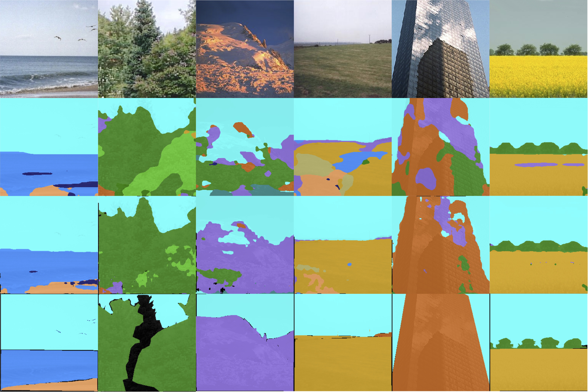

# CRRN-SceneLabeling
Deep Contextual Recurrent Residual Networks for Scene Labeling

T. Hoang Ngan Le, Chi Nhan Duong, Ligong Han, Khoa Luu, Marios Savvides, Dipan Pal



### Introduction

This is the repository for Deep Contextual Recurrent Residual Networks ([Deep CRRN](https://arxiv.org/pdf/1704.03594))
 
## Citation

If you find this code useful please cite us in your work:

```
@article{NganLe2017DeepCRRN,
  title={Deep Contextual Recurrent Residual Networks for Scene Labeling},
  author={Le, T. Hoang Ngan and Duong, Chi Nhan and Han, Ligong and Luu, Khoa and Savvides, Marios and Pal, Dipan},
  journal={arXiv preprint arXiv:1704.03594},
  year={2017}
}
```

### Our Results

0. Video Inpainting results: [Dropbox](https://www.dropbox.com/s/w3ti8i7eg7it35n/Video_inpainting_demo.mp4?dl=0)
0. Real-time Background subtraction results: [Dropbox](https://www.dropbox.com/sh/rqneam8659js80k/AAByj0oBtX4V4D-4h_WBviXXa?dl=0)
0. Code of OLP-RPCA is coming soon!
