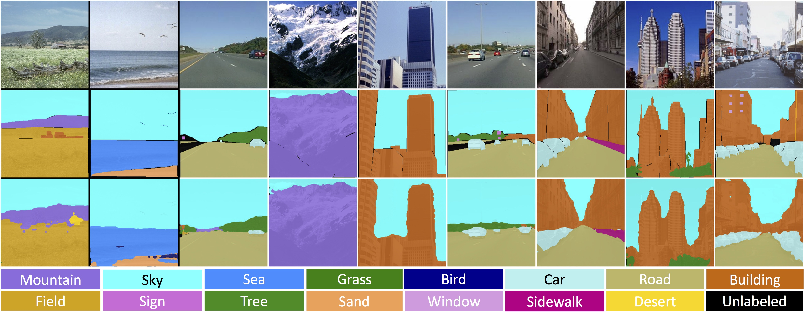

# CRRN-SceneLabeling
Deep Contextual Recurrent Residual Networks for Scene Labeling

T. Hoang Ngan Le, Chi Nhan Duong, Ligong Han, Khoa Luu, Marios Savvides, Dipan Pal

<p align="center"></p>

### Introduction

This is the repository for Deep Contextual Recurrent Residual Networks ([Deep CRRN](https://arxiv.org/pdf/1704.03594))
 
## Citation

If you find this code useful please cite us in your work:

```
@article{NganLe2017DeepCRRN,
  title={Deep Contextual Recurrent Residual Networks for Scene Labeling},
  author={Le, T. Hoang Ngan and Duong, Chi Nhan and Han, Ligong and Luu, Khoa and Savvides, Marios and Pal, Dipan},
  journal={arXiv preprint arXiv:1704.03594},
  year={2017}
}
```

### Our Results

Examples of labeling results on SiftFlow 
 

Examples of labeling results on CamVid


Examples of labeling results on SUN dataset


